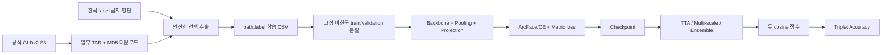

# 랜드마크 유사도 프로젝트 이해하기

이 문서는 코드를 처음 보는 사람도 “사진이 어디서 와서, 모델 안에서 무엇이 되고, 마지막 점수가 어떻게 나오는지” 이해할 수 있게 설명합니다. 복사해서 실행할 한 줄 명령은 [README.md](README.md)에 있습니다.

## 1. 이 프로젝트가 푸는 문제

시험 한 문제에는 사진 세 장이 있습니다.

- Anchor: 기준 사진
- Positive: Anchor와 같은 랜드마크
- Negative: Anchor와 다른 랜드마크

모델은 각 사진을 512개 정도의 숫자로 된 좌표인 임베딩으로 바꿉니다. 임베딩 길이는 항상 1로 맞춥니다. 그러면 두 임베딩을 곱해서 더한 값이 바로 cosine similarity가 됩니다.

```text
sim(Anchor, Positive) > sim(Anchor, Negative) 이면 정답
```

학습에는 한국 랜드마크를 넣지 않습니다. 평가는 학습에서 보지 못한 한국 랜드마크로 하므로, 단순 암기가 아니라 새로운 장소에 일반화하는 능력이 중요합니다.

## 2. 전체 흐름



## 3. 데이터 폴더

```text
데이터셋 최상위 폴더/
├─ gldv2/
│  ├─ korean_label_ids.txt
│  ├─ metadata/train.csv
│  ├─ metadata/md5/train/
│  ├─ archives/train/images_000.tar ...
│  ├─ train/a/b/c/<image_id>.jpg
│  ├─ train_labels.csv
│  └─ preparation_audit.json
└─ data/
   ├─ triplets.json
   └─ validation/
```

`gldv2`는 학습용입니다. `data`는 한국 채점용입니다. 두 폴더의 역할을 섞으면 안 됩니다.

`train_labels.csv`는 다음처럼 단순합니다.

```csv
path,label
0/1/2/0123456789abcdef.jpg,142820
0/1/3/013456789abcdef0.jpg,142820
```

경로는 `gldv2/train` 기준 상대경로라서 컴퓨터가 바뀌어도 데이터셋 최상위 폴더만 다시 지정하면 됩니다.

## 4. GLDv2 일부 다운로드와 준비

공식 GLDv2 학습 이미지는 약 1GB짜리 TAR 500개로 나뉩니다. 전체를 받을 필요가 없으므로 `--archive-count`로 처음 몇 개를 받을지 정합니다.

준비 코드는 다음 일을 순서대로 합니다.

1. 공식 `train.csv`와 선택한 TAR의 MD5 파일을 받습니다.
2. TAR를 `.part`에 받아 덜 받은 파일과 완성 파일을 구분합니다.
3. MD5가 공식 값과 같은지 확인합니다.
4. TAR 안에서 image ID만 읽고, 큰 메타데이터 전체를 메모리에 복사하지 않습니다.
5. 선택된 image ID만 `landmark_id`와 연결합니다.
6. `korean_label_ids.txt`에 든 label을 제외합니다.
   파일이 없으면 HuggingFace `visheratin/google_landmarks_places`에서 South Korea/North Korea id를 자동 수집해 생성합니다.
7. Windows 앱과 README 명령은 1장짜리 label도 CSV에 남깁니다. classification 단계는 이를 사용하고, metric 단계는 2장 미만을 다시 제외합니다.
8. TAR의 낯선 경로를 믿지 않고 `첫 글자/둘째 글자/셋째 글자/id.jpg`를 직접 만듭니다.
9. TAR의 image ID가 metadata에 모두 있는지 확인합니다. 한국 차단 명단과 manifest의 SHA-256을 audit JSON에 기록한 뒤 원자적으로 저장합니다.

TAR 하나에는 여러 나라가 섞여 있습니다. 그래서 한국 파일의 다운로드 자체를 미리 피할 수는 없습니다. 대신 검증된 한국 label을 추출 결과와 학습 CSV에서 제거합니다.

## 5. 한국 label ID 파일

이 파일은 “이 번호는 학습 금지”라고 적은 명단입니다.

공식 GLDv2 메타데이터에는 나라 열이 없습니다. 따라서 코드가 이름만 보고 한국인지 맞힐 수 없습니다. 외부 컴퓨터의 신뢰 가능한 필터 과정에서 만든 한국 `landmark_id`를 한 줄에 하나씩 보관해야 합니다.

빈 명단은 증거가 아니므로 거부합니다. 다운로드할 때 한 번, 학습 시작 전에 한 번 더 검사합니다. audit JSON에는 몇 장을 제외했는지와 최종 한국 label 교집합이 0인지 기록합니다.

## 6. 사진을 읽는 Backbone

Backbone은 사진에서 선, 창문, 탑, 지붕, 질감 같은 특징을 찾는 “눈”입니다.

### EfficientNetV2-S

- CNN 구조입니다.
- 비교적 빠르고 RTX 5070 한 장에서 기준선을 만들기 좋습니다.
- 300, 384 같은 입력 크기를 바로 실험할 수 있습니다.

### DINOv2-S/B

- 큰 자연 이미지 모음에서 self-supervised 방식으로 사전학습된 Vision Transformer입니다.
- 처음 보는 장소로 일반화하는 실험 후보입니다.
- 사진을 14×14 patch로 나누므로 입력 크기는 378, 392, 448처럼 14의 배수를 씁니다.
- CLS token과 실제 patch token을 분리합니다.
- backbone 전체를 고정하거나 마지막 transformer block 몇 개만 작은 학습률로 열 수 있습니다.
- DINOv2용 ImageNet mean/std를 checkpoint에 저장합니다.

## 7. 여러 특징을 한 벡터로 모으는 Pooling

Backbone은 위치마다 특징을 많이 만듭니다. Pooling은 이것을 사진 하나의 대표 벡터로 모읍니다.

### Average

모든 위치를 같은 비중으로 평균냅니다. 가장 단순한 기준입니다.

### GeM

중요한 반응을 평균보다 조금 더 크게 반영합니다. CNN feature map과 DINOv2 patch token 모두 실제 GeM 공식을 사용합니다.

### compact SALAD

SALAD는 patch를 여러 cluster에 나눕니다.

- local projection: patch를 작은 지역 descriptor로 바꿉니다.
- cluster score: 어느 cluster와 가까운지 계산합니다.
- dustbin: 배경처럼 도움 안 되는 patch가 들어갈 쓰레기통입니다.
- log-domain Sinkhorn: cluster와 patch의 배정량을 반복해서 맞춥니다.
- residual aggregation: cluster 중심과 patch의 차이를 모읍니다.
- global token: 사진 전체 정보도 따로 붙입니다.

공식 GPL 코드를 복사하지 않고 논문 구조를 독립 구현했습니다. 기본 compact 설정은 `16×64 local + 256 global`이고, 뒤에서 512차원으로 줄입니다.

### DOLG-style

CNN의 지역 특징과 전역 특징을 합칩니다.

1. dilation 1·2·3 convolution으로 서로 다른 범위의 지역 문맥을 봅니다.
2. spatial attention으로 중요한 위치를 모읍니다.
3. global GeM으로 사진 전체 특징을 만듭니다.
4. 지역 벡터에서 전역 벡터 방향을 빼 두 정보가 같은 말만 반복하지 않게 합니다.
5. 두 벡터를 붙입니다.

핵심 아이디어를 구현한 실험 head이며 원 논문의 전체 stage를 그대로 복제한 모델은 아니므로 이름도 DOLG-style로 사용합니다.

## 8. Projection과 L2 정규화

Pooling 결과 차원은 모델마다 다릅니다. Projection은 이것을 같은 512차원으로 바꿉니다.

```text
Pooling 결과 → Linear → LayerNorm → SiLU → L2 normalize
```

마지막 L2 정규화 때문에 임베딩 길이가 1이 되고, 내적이 cosine similarity가 됩니다.

## 9. 분류 Head

### Linear + Cross Entropy

일반 시험처럼 정답 class 번호를 맞힙니다.

### ArcFace

임베딩과 class 중심을 모두 정규화하고, 정답 각도에 margin을 더합니다. 정답만 겨우 맞히는 대신 다른 class와 각도 차이를 더 벌리도록 요구합니다. 최종 평가가 cosine이므로 목적이 잘 맞습니다.

### Sub-center ArcFace

class마다 중심을 하나가 아니라 여러 개 둡니다. 같은 랜드마크의 정면·옆면처럼 모습이 크게 다르거나 noisy label이 있을 때 실험할 수 있습니다. 대신 classifier 메모리는 중심 수만큼 늘어납니다.

## 10. Metric Loss

Cross Entropy와 함께 다음 중 하나를 선택합니다. 전부 동시에 켜지 않습니다.

### Batch-hard Triplet

현재 batch에서 가장 먼 Positive와 가장 가까운 Negative를 골라 margin을 확보합니다.

### Supervised Contrastive

같은 label의 나머지 사진을 모두 Positive로 사용합니다. 한 label 사진이 2장 이상 있어야 의미가 있습니다.

### Proxy Anchor

분류기 weight를 억지로 재사용하지 않고 class마다 별도의 학습 proxy를 둡니다. Proxy 상태는 optimizer와 checkpoint에 함께 저장됩니다.

## 11. Cross-Batch Memory

작은 GPU에서는 batch 안 Negative 수가 부족합니다. XBM은 이전 batch의 정규화 임베딩과 label을 FIFO 줄에 저장합니다.

- 과거 임베딩은 `detach`해서 과거 그래프를 붙잡지 않습니다.
- 현재 임베딩만 gradient를 받습니다.
- warm-up 뒤부터 현재 Anchor와 memory의 hard Positive/Negative를 찾습니다.
- queue 내용과 capacity를 checkpoint에 저장해 resume합니다.

## 12. singleton 분류 사전학습

사진이 한 장뿐인 label은 Triplet Positive를 만들 수 없습니다. 그러나 class 번호를 맞히는 학습에는 사용할 수 있습니다.

```text
1단계 classification: 최소 1장, CE/ArcFace만 사용
2단계 metric: 최소 2장, Triplet/SupCon/Proxy Anchor 사용
```

두 단계의 label 수가 다르면 classifier는 가져오지 않고 backbone과 projection의 호환되는 weight만 가져옵니다.

## 13. 이미지 크기와 증강

`basic`은 random crop과 좌우 반전입니다. `weak`은 여기에 약한 밝기·대비·채도, 낮은 확률 grayscale, ±5도 회전, 작은 Random Erasing을 더합니다.

건물 모양을 망가뜨릴 수 있는 세로 뒤집기, 강한 perspective, MixUp/CutMix은 기본 구현에 넣지 않았습니다.

해상도를 높이면 작은 창문과 문양을 더 볼 수 있지만 메모리 사용량도 커집니다. batch가 줄면 XBM을 비교할 이유가 생깁니다.

## 14. 안전한 학습/검증 분리

CSV SHA-256과 train/validation label 목록을 split manifest에 저장합니다. 다음 실행에서도 같은 label 분할을 씁니다.

- 기본은 label-disjoint split입니다.
- country 열이 있을 때는 country-disjoint split도 가능합니다.
- 검증 triplet은 학습 전에 고정합니다.
- hard-negative CSV의 Anchor와 Negative가 고정 train split 안에 있는지 검사합니다.
- 한국 평가 데이터는 이 과정에 들어오지 않습니다.

## 15. FAISS Hard Negative

FAISS HNSW는 모든 `N×N` 유사도 행렬을 만들지 않고 가까운 후보를 찾습니다. 같은 label은 건너뛰고 다른 label 중 가까운 이미지를 CSV로 저장합니다.

fine-tuning에서는 초반 hard 사용 비율과 마지막 비율을 따로 지정해 점점 어려운 문제를 늘릴 수 있습니다. 새 checkpoint가 생기면 Negative도 다시 찾을 수 있습니다.

## 16. 학습 진행률과 GPU

학습은 50 batch마다 글자를 찍지 않고 매 batch 같은 줄의 퍼센트 막대를 갱신합니다.

```text
epoch=2 [##############----------------] 46.88% batch=15/32 loss=0.84210
```

GPU 이름은 RTX 5070 문자열을 가정하지 않고 `nvidia-smi`와 `torch.cuda.get_device_name`이 실제로 보고한 값을 표시합니다. CUDA에서는 AMP를 사용합니다.

## 17. Checkpoint

Checkpoint에는 다음이 들어갑니다.

- backbone, pooling, classifier 종류와 세부 파라미터
- image size, mean/std, resize 방식
- model weight와 label-index 표
- optimizer, scheduler, AMP scaler
- Proxy Anchor 상태와 XBM queue
- epoch, validation Accuracy, 최고 epoch
- 실행 인수 전체

`--init-checkpoint`는 호환 weight만 가져와 새 실험을 시작합니다. `--resume-checkpoint`는 같은 실험의 상태를 정확히 이어가므로 주요 인수가 다르면 중단합니다.

## 18. 추론

### TTA

- `none`: 원본 view 하나
- `flip`: 원본 + 좌우 반전
- `five_crop`: 네 모서리 + 중앙
- `five_crop_flip`: five-crop 각각의 좌우 반전까지 총 10개

view 임베딩을 평균낸 뒤 다시 L2 정규화합니다.

### Multi-scale

같은 사진을 여러 크기로 추론하고 scale별 임베딩을 평균합니다. DINOv2 scale은 14의 배수여야 합니다.

### Ensemble

checkpoint마다 cosine 점수를 계산한 뒤 점수를 평균합니다. 따라서 EfficientNet 512차원과 SALAD 512차원처럼 서로 다른 모델을 섞을 수 있고, 원래 descriptor 차원이 달라도 됩니다.

### LightGlue 지역 재정렬

global Positive/Negative 점수 차이가 작은 애매한 triplet만 지역 특징을 비교합니다.

1. ALIKED, DISK 또는 SuperPoint keypoint를 찾습니다.
2. LightGlue로 대응점을 연결합니다.
3. 대응점이 4개 이상이면 homography를 계산합니다.
4. RANSAC inlier 비율을 local geometric score로 사용합니다.
5. `global cosine + local weight × inlier ratio`로 결합합니다.

선택 기능이라 별도 requirements 파일로 설치합니다.

## 19. Windows 앱

앱 메뉴는 복잡한 하이퍼파라미터를 숨기고 다음 작업만 보여 줍니다.

1. 패키지 설치
2. 실제 GPU 확인
3. 데이터셋 최상위 폴더 저장
4. GLDv2 일부 다운로드와 manifest 생성
5. 모델 프리셋 학습
6. FAISS hard-negative 생성
7. TTA/multi-scale/ensemble 추론
8. Accuracy 확인

ArcFace, DINOv2 GeM, compact SALAD, DOLG-style, singleton 사전학습을 프리셋으로 고를 수 있습니다. SupCon, Proxy Anchor, XBM 같은 고급 비교는 README의 한 줄 CLI를 사용합니다.

## 20. 주요 코드 파일

| 파일 | 역할 |
| --- | --- |
| `src/triplet_landmark/prepare_gldv2.py` | 공식 shard 다운로드, MD5, 한국 제외, 추출, manifest/audit |
| `src/triplet_landmark/data.py` | CSV 안전 검사, split, resize, 증강, TTA |
| `src/triplet_landmark/model.py` | EfficientNet/DINOv2, GeM, SALAD, DOLG-style, ArcFace |
| `src/triplet_landmark/train.py` | CE, metric loss, XBM, hard-negative, checkpoint, 진행률 |
| `src/triplet_landmark/mine_hard_negatives.py` | FAISS HNSW 검색 |
| `src/triplet_landmark/predict_triplets.py` | TTA, multi-scale, ensemble, 점수 CSV |
| `src/triplet_landmark/local_matching.py` | 선택적 LightGlue+homography 점수 |
| `windows_app.py` | 단순 Windows 메뉴와 경로 설정 |

## 21. 실험하는 법

성능 기능이 많아졌다고 모두 켜면 안 됩니다. 다음처럼 한 줄만 바꿉니다.

```text
E0 EfficientNet + GeM + Linear + Triplet
E1 E0에서 classifier만 ArcFace
E2 E1에서 입력만 384
E3 E2에서 증강만 weak
E4 같은 데이터로 DINOv2 + token GeM
E5 DINOv2에서 GeM만 compact SALAD로 변경
E6 가장 좋은 모델에 XBM 또는 다른 metric loss 하나 추가
E7 추론 TTA, multi-scale, ensemble, LightGlue를 하나씩 비교
```

비한국 고정 검증 split과 seed 3개에서 평균과 표준편차를 기록합니다. 한국 채점 결과를 보고 계속 설정을 고르면 한국 데이터에 간접적으로 맞추게 될 위험이 있습니다.

## 22. 중요한 한계

- 구현했다고 반드시 Accuracy가 오르는 것은 아닙니다.
- 공식 GLDv2에는 국가 코드가 없으므로 한국 label 명단의 품질은 외부 필터 과정에 달려 있습니다.
- compact SALAD와 DOLG-style은 각각 원 논문의 실험 설정 전체를 그대로 복제한 모델이 아닙니다.
- LightGlue는 자연물, 야간, 겹치는 영역이 작은 사진에서 오히려 흔들릴 수 있습니다.
- 실제 RTX 5070 batch 크기는 이미지 크기와 모델에 따라 조절해야 합니다.

가장 안전한 시작은 `EfficientNetV2-S + GeM + ArcFace`이고, 그다음 DINOv2 GeM, compact SALAD 순서로 비교하는 것입니다.
